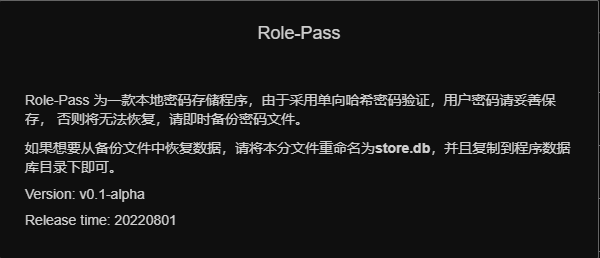
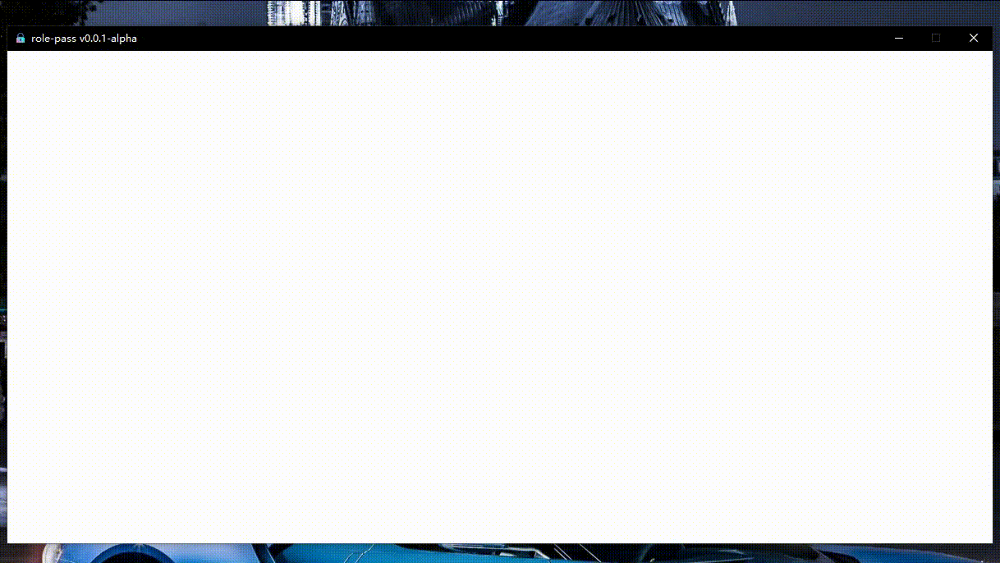

# role-pass
Role-pass 是一款开源本地存储密码软件，使用单向哈希进行密码验证，然后使用原始密码进行对于其他字段进行加密。
理论上只有清楚原密码才可以被攻破，忘记密码后无法恢复！

Role-pass 主要的特色就是单个用户可以拥有多个角色，方便管理多个角色下的不同密码，防止密码混乱。

程序下载：[链接](https://github.com/2Mw/role-pass/releases/latest)



## 技术栈

语言：Rust，JS

框架：Tauri，Vue

## 特性
1. 设置设备锁
2. 单用户多角色
3. 密码强度高，使用 ChaCha20 进行加密（含salt）
4. 支持导出和备份

## How to use

1. 设置设备锁



2. 创建用户与登录


3. 添加账号信息


4. 修改账号


## RoadMap
1. import
2. support modify user password.

## Project build
```shell
cd $PROJECT/src-tauri
cargo tauri build
# run program win
./target/release/role-pass.exe
```
